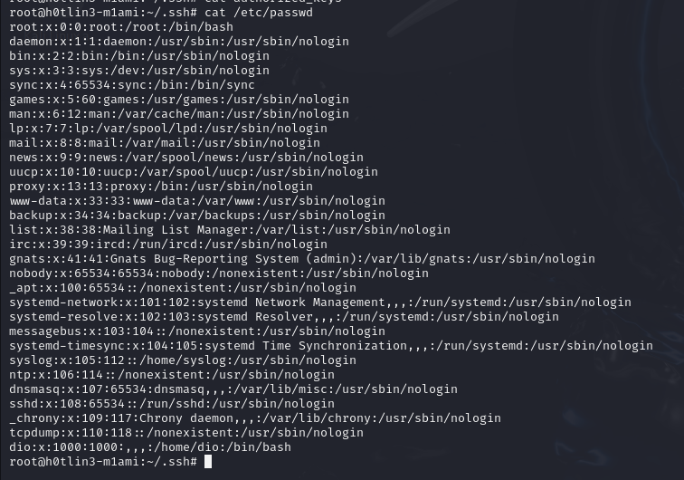
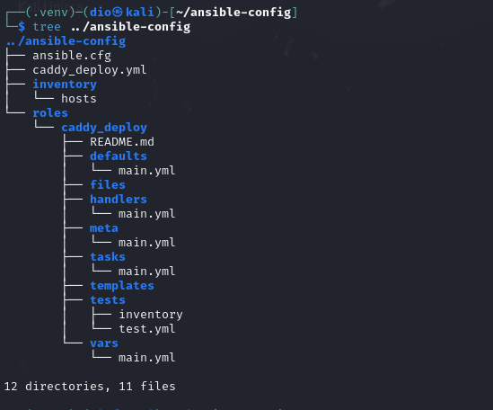
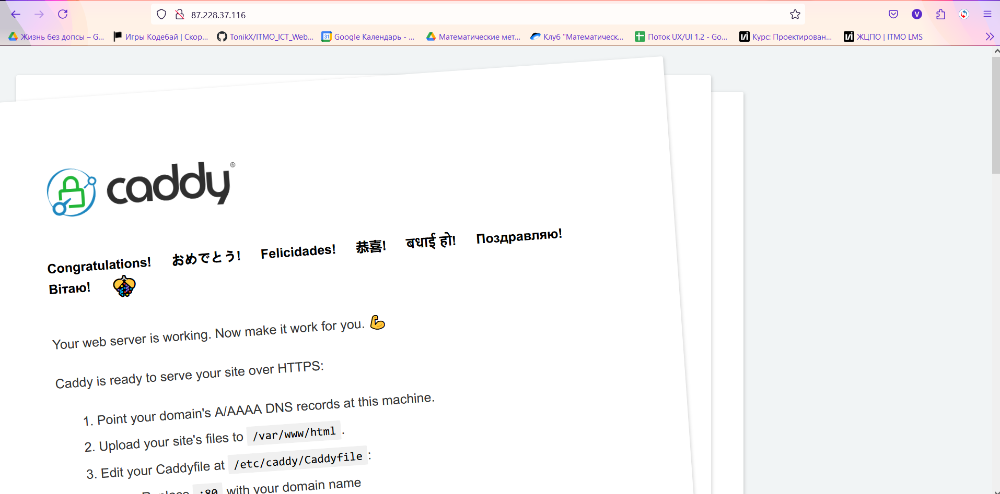

# Лабораторная работа 2

## Цель работы

На целевом сервере установить Ansible и вебсервер Candy

## Ход работы

(осторожно много букаф)

### Настройка ssh-сервера

Вообще этого пункта нет в лабе, но раз уж нам дан удалённый сервер на виртуальной машине от ©Selectel, то почему бы не сделать базовую вещь для системного админа Linux сервера - настройка ssh (ну а ещё повыпендриваться, кекв).

Итак, надо настроить ssh-сервер; айпи от сервера я дам, креды от рута я дам. Подключаемся под рутом по паролю к серверу.

Первой хорошей практикой является создание отдельного пользователя, чтобы подключаться к нему, а не к руту напрямую. Пишем в консольке `adduser dio`, чтобы создать пользователя dio и далее `adduser dio sudo`, чтобы дать ему доступ к sudo. Проверим `/etc/passwd`, чтобы убедиться в существовании нового пользователя:



Второй хорошей практикой является вход по ключам, а не паролям. Переходим в хомяка dio, создаём там директорию .ssh, и в ней создаём ещё файл authorized_keys. Она будет нужна, чтобы хранить публичные ключи ssh-клиентов.

Собственно теперь создадим этот ключ. На основной системе пишем `ssh-keygen -t ed25519 -f ~/.ssh/NetworkAdministration_key` - это команда создаст в директории .ssh 2 файла: `NetworkAdministration_key.pub` - публичный OpenSSH ключ и `NetworkAdministration_key` - приватный OpenSSH в пару к публичному. Приватный храним на системе как зиницу ока, а публичный надо перекинуть на сервер. Копируем содержимое публичного ключа:

```haskell
┌──(dio㉿kali)-[~/.ssh]
└─$ cat NetworkAdministration_key.pub
ssh-ed25519 AAAAC3NzaC1lZDI1NTE5AAAAILPOWy2rAeiBNU0ozgwTaiB+KlCg+9FaldWy/j9t5juc dio@kali
```

и перекидываем содержимое в файл authorized_keys на сервере, который был создан ранее.

Сейчас главное не провафлить и корректно настроить права доступа к .ssh. Ключи добавлял пользователь root, а подключаться будет пользователя без рута, следовательно permission denied и невозможно зайти по ключу. Настройки следующие:

```haskell
# меняем создателя и владельца на dio
root@h0tlin3-m1ami:/home/dio# chown -R dio:dio .ssh
# настраиваем права доступа
root@h0tlin3-m1ami:/home/dio# chmod 700 .ssh
root@h0tlin3-m1ami:/home/dio# chmod 644 .ssh/*
root@h0tlin3-m1ami:/home/dio# chmod 600 .ssh/id_* .ssh/authorized_keys
```

(вообще такой способ добавления ключей является сверхмерой и рекомендуется использовать ssh-copy-id)

Круто, теперь можно по приватному ключу заходит на сервер под моим именем (dio) без пароля (ну почти - я поставил пассфразу на ключ).

```haskell
┌──(dio㉿kali)-[~/.ssh]
└─$ ssh -i NetworkAdministration_key dio@87.228.37.116 
Enter passphrase for key 'NetworkAdministration_key': 
Welcome to Ubuntu 22.04.5 LTS (GNU/Linux 5.15.0-124-generic x86_64)

 * Documentation:  https://help.ubuntu.com
 * Management:     https://landscape.canonical.com
 * Support:        https://ubuntu.com/pro

Expanded Security Maintenance for Applications is not enabled.

0 updates can be applied immediately.

Enable ESM Apps to receive additional future security updates.
See https://ubuntu.com/esm or run: sudo pro status


The list of available updates is more than a week old.
To check for new updates run: sudo apt update
New release '24.04.1 LTS' available.
Run 'do-release-upgrade' to upgrade to it.


Last login: Mon Dec  2 19:44:57 2024 from 45.12.138.15
dio@h0tlin3-m1ami:~$ 
```

Осталось настроить конфиг ssh-демона в файле `/etc/.sshd_config`, чтобы наши добавления имели какой-то смысл. Вот строки, которые я проверил и раскомментировал:

```haskell
# запрет подключаться к руту
PermitRootLogin no
# можно по публичным ключам
PubkeyAuthentication yes
# нельзя по паролям
PasswordAuthentication no
```

После этого надо перезапустить ssh сервис

```haskell
root@h0tlin3-m1ami:/etc/ssh# systemctl restart ssh
```

Бум - у нас ssh-сервер, к которому можно подключиться только по ключу и на созданного юзера

Можно ещё было бы сдвинуть порт с 22, можно было бы настроить порт-нокинг, но это уже сверхмера...

**Attention** - я решил оставить открытым вход руту по паролю на случай если ментор решит проверить вм и лишний раз не дёргать друг друга.

### Настройка локального shh-клиента

Так, постоянно указывать путь к приватному ключу при подключении - долго, поэтому настроим ssh-клиент на основной машине. В .ssh на основной машине создаём файл `config` с таким содержанием:

```haskell
Host netadmin-wm
        StrictHostKeyChecking no
        User dio
        ForwardAgent yes
        IdentityFile /home/dio/.ssh/NetworkAdministration_key
        IdentitiesOnly yes
        UserKnownHostsFile=/dev/null
        AddKeysToAgent yes
        ServerAliveInterval 60
        ServerAliveCountMax 1200
```

Вроде бы всё, а нет - надо как-то подсказать ssh, что netadmin-wm - это хост нашего сервера - добавим строку в файл /etc/hosts:

```haskell
...
87.228.37.116   netadmin-wm
```

Проверяем клиент: (запрос пассфразы происходит только в первый раз)

```haskell
┌──(dio㉿kali)-[~]
└─$ ssh netadmin-wm     
Warning: Permanently added 'netadmin-wm' (ED25519) to the list of known hosts.
Welcome to Ubuntu 22.04.5 LTS (GNU/Linux 5.15.0-124-generic x86_64)

 * Documentation:  https://help.ubuntu.com
 * Management:     https://landscape.canonical.com
 * Support:        https://ubuntu.com/pro

Expanded Security Maintenance for Applications is not enabled.

0 updates can be applied immediately.

Enable ESM Apps to receive additional future security updates.
See https://ubuntu.com/esm or run: sudo pro status


The list of available updates is more than a week old.
To check for new updates run: sudo apt update
New release '24.04.1 LTS' available.
Run 'do-release-upgrade' to upgrade to it.


Last login: Mon Dec  2 20:48:05 2024 from 45.12.138.15
dio@h0tlin3-m1ami:~$ 
```

Красота? Красота!

### Установка и настройка Ansible

По заданию, нам надо через питоновский пакетный инсталлер (pip) скачать ansible и проверить его работоспособность через пинг локалхоста (будем пинговать наш удалённый хост)

Что вообще такое ansible? Ansible - система управления конфигурациями на удалённых серверах с основной машины. Его фишкой на фоне других схожих ПО является отсутствие необходимости в установке агентов на удалённые сервера - система работа от одной программы на основной машине.

Собственно, это всё к чему - в задании не описана в подробностях работа с ansible в варианте наличия удалённого хоста, поэтому решил уточнить этот момент здесь. Ansible будет поставлен на мою основную систему, чтобы выполнять различные действия на удалённом сервере от Селектела.

Сперва по работе просят проверить работу ansible на простом пинге локалхоста.

Небольшая настройка ансибла


и дёргаем модуль пинга

```haskell
dio@h0tlin3-m1ami:~/ansible-config$ ansible my_servers -m ping
[WARNING]: Platform linux on host local_server is using the discovered Python interpreter at /usr/bin/python3.10,
but future installation of another Python interpreter could change the meaning of that path. See
https://docs.ansible.com/ansible-core/2.17/reference_appendices/interpreter_discovery.html for more information.
local_server | SUCCESS => {
    "ansible_facts": {
        "discovered_interpreter_python": "/usr/bin/python3.10"
    },
    "changed": false,
    "ping": "pong"
}
```

SUCCESS - это победа. Тут, в команде мы уточняем в каким хостам обращаться через поле my_servers - они описаны в `inventory/hosts/`, потом обращается к модулю `ping` через флаг `-m`. Ansible по стандарту поключается по ssh.

Теперь, для практики надо создать файл, прочитать и удалить его


### Установка Caddy

Установка Caddy будет производиться средствами Ansible - сперва инициализируем роль с именем `caddy_deploy` в директории `roles`. Роль - это специальная структура в ansible, которая позволяет удобно структурировать информацию по задаче. Для этого используется команда `ansible-galaxy init caddy_deploy`:

Структура роли задана. Теперь определим задачу (task). Задача - это последовательный набор модулей. Модуль - это наименьшая единица операции в ansible (например, чтобы пингануть сервер мы использовали модуль ping, для обращения в терминал - shell, а для работы с файлами - file). В директории `caddy_deploy/tasks/` пропишем файл `main.yml`:

```YAML
---
# tasks file for caddy_deploy

- name: Install prerequisites
  apt:
    pkg:
    - debian-keyring
    - debian-archive-keyring
    - apt-transport-https
    - curl

- name: Add key for Caddy repo
  apt_key:
    url: https://dl.cloudsmith.io/public/caddy/stable/gpg.key
    state: present
    keyring: /usr/share/keyrings/caddy-stable-archive-keyring.gpg

- name: add Caddy repo
  apt_repository:
    repo: "deb [signed-by=/usr/share/keyrings/caddy-stable-archive-keyring.gpg] https://dl.cloudsmith.io/public/caddy/stable/deb/debian any-version main"
    state: present
    filename: caddy-stable

- name: add Caddy src repo
  apt_repository:
    repo: "deb-src [signed-by=/usr/share/keyrings/caddy-stable-archive-keyring.gpg] https://dl.cloudsmith.io/public/caddy/stable/deb/debian any-version main"
    state: present
    filename: caddy-stable

- name: Install Caddy webserver
  apt:
    name: caddy
    update_cache: yes
    state: present
```

Всё это добро будет взлетать из плейбука. Создадим в корне ансибла конфиг плейбука.

```YAML
---
- name: Install and configure Caddy webserver  # Любое описание
  hosts: my_servers  # хосты из файла inventory/hosts, где будем выполнять наш плейбук
  connection: ssh # подключения по ssh
  become: true # для выполнения модулей потребуются права рута, значит надо потребовать эскалацию привелегий

  roles:
    - caddy_deploy  # собственно, роль для выполнения                                    
```

(К слову, в `ansible.cfg` я добавил пункт `nocows = 1`, поскольку на моей машине стоит утилита `cowsay` и автор ансибла решил, что если при его наличии вызывать все системные сообщения с её помощью - это будет весело. На деле это неудобно.)

Итоговая структура конфигурации ансибла



Вызываем команду `ansible-playbook caddy_deploy.yml --ask-become-pass` для запуска caddy.




### Домен и настройка Caddyfile

Регаем бесплатный домен на сайте duckdns.org с данным айпишником. У меня будет домен zzzvvv.duckdns.org.


Далее просят написать переменные и шаблон для Caddyfile (с помощью Jinja2)

roles/caddy_deploy/templates/Caddyfile.j2

```html
{{ domain_name }} {
        root * /usr/share/caddy
        file_server

        log {
                output file {{ log.file }}
                format json
                level {{ log.level }}
        }
}
```

roles/caddy_deploy/vars/main.yml

```yaml
---
# vars file for caddy_deploy

domain_name: прописываем.свой.домен

log:  # Можно поиграться со значениями
  file: /var/log/caddy_access.log
  level: "INFO"
```

И добавить ещё 2 модуля к таске:

roles/caddy_deploy/tasks/main.yml

```yaml

- ...

- name: Create config file
  template:
    src: templates/Caddyfile.j2  # Откуда берем
    dest: /etc/caddy/Caddyfile  # Куда кладем

- name: Reload with new config
  service:
    name: caddy
    state: reloaded
```

Запускаем плейбук вновь и проверяем, что на тестовом сайте появился ssl сертификат и работает https.


## Задание

1) Переписать пример с созданием и удалением файла из шага 5 Части 1 с ad-hoc команд на плейбук формат, а так же добавить четвертый шаг - перед удалением поменять содержимое файла на любое другое.
2) сделать всю работу на удалённом хосте, а не на одном localhost-е

плейбук для операций с файлом:

```haskell
┌──(.venv)─(dio㉿kali)-[~/ansible-config]
└─$ cat file_operations.yml
---
- name: make file operations
  hosts: my_servers

  vars:
    first_text: first_text_content
    second_text: second_text_content
    home: "{{ lookup('env', 'HOME') }}"

  tasks:
  - name: create file
    shell:
      cmd: "echo {{ first_text }} > $HOME/test.txt"

  - name: read file data first time
    shell:
      cmd: "cat $HOME/test.txt"
    register: data

  - name: file data in stdout
    debug:
      msg: "{{ data.stdout }}"

  - name: change file date
    shell:
      cmd: "echo {{ second_text }} > test.txt"

  - name: read file data second time
    shell:
      cmd: "cat $HOME/test.txt"
    register: data

  - name: read file second time
    debug:
      msg: "{{ data.stdout }}"

  - name: delete file
    file:
      path: "test.txt"
      state: absent
```


