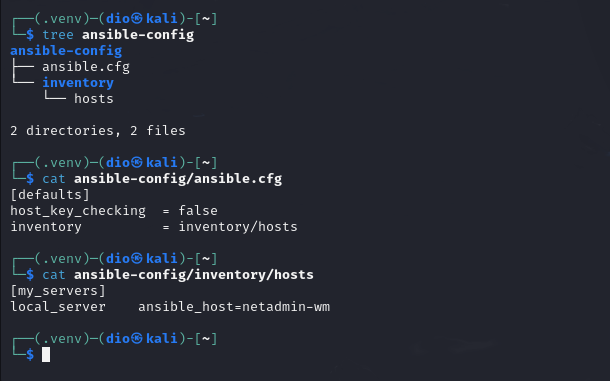
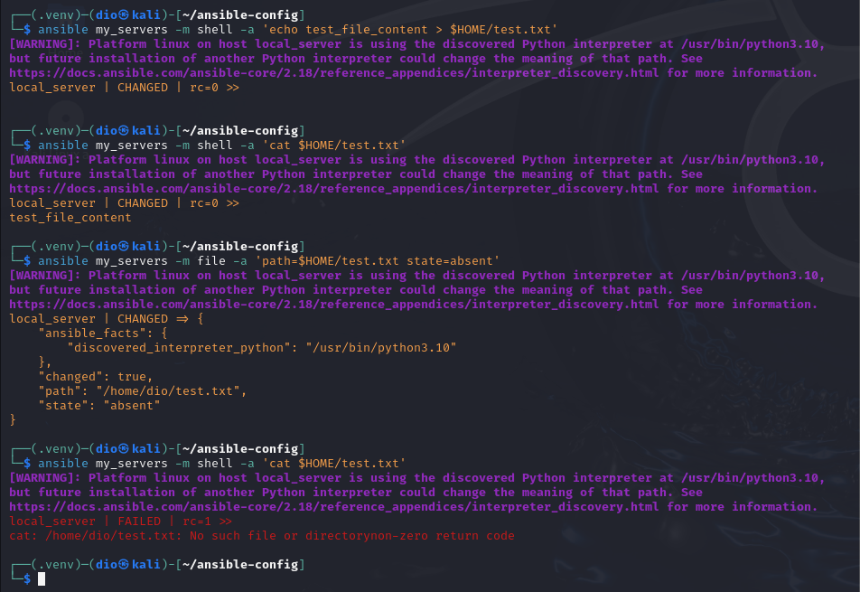
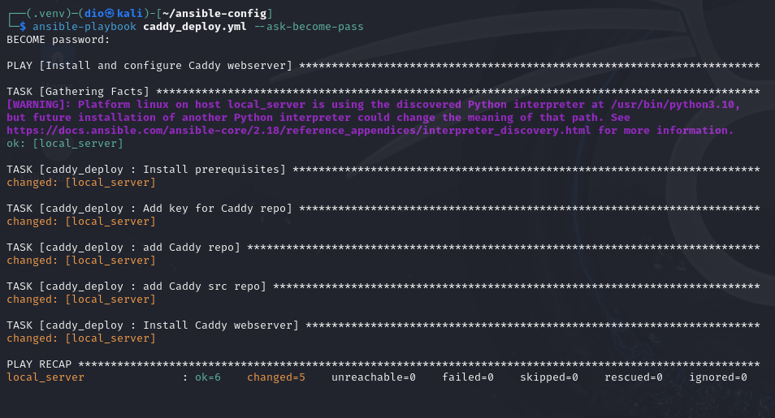
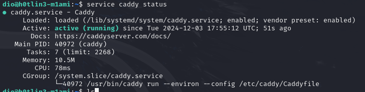
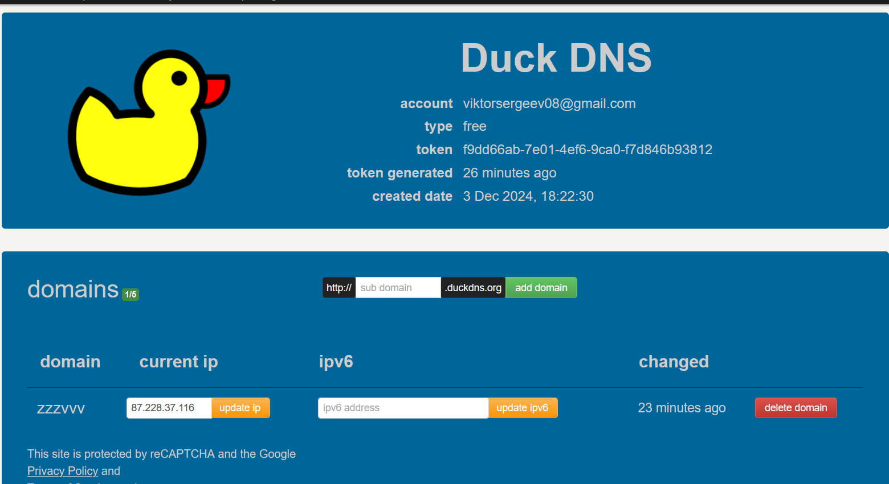
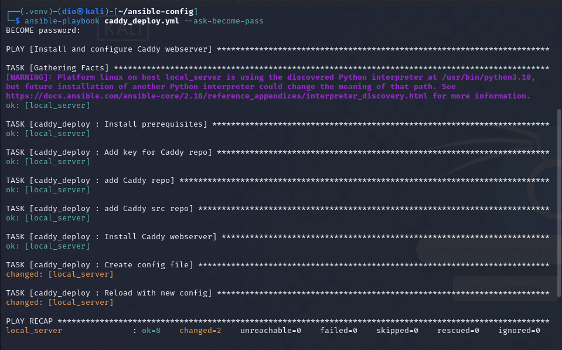
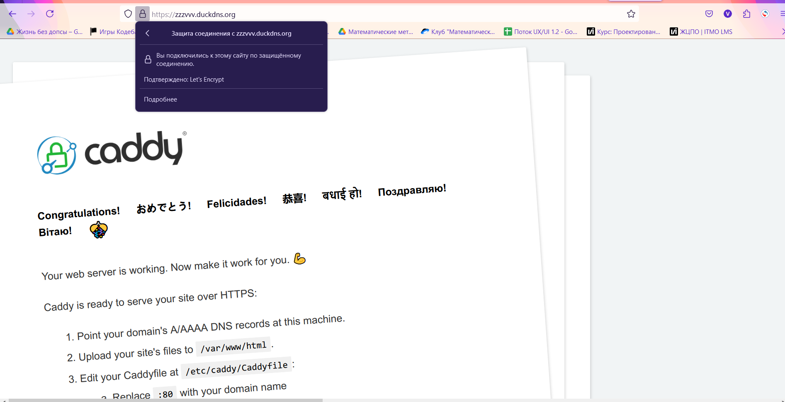
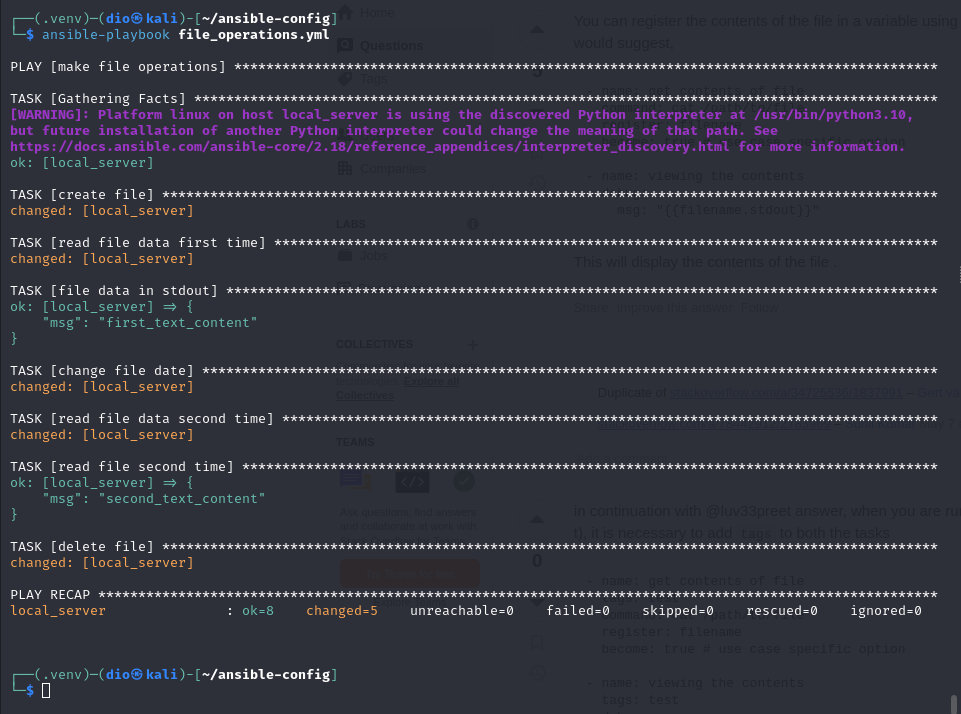

# Ansible + Caddy. Отчет по лабораторной работе

## Часть 1: Настройка и тестирование Ansible

### Установка Ansible

Для установки Ansible используем Python Package Index (pip). Выполним следующие команды:
```bash
# Устанавливаем Ansible через pip
python3 -m pip install --user ansible

# Проверяем версию установленного Ansible
ansible --version
```
Ansible будет настроен на основном сервере для управления действиями на целевом сервере. Подключение будет осуществляться через SSH.

### Тестирование
Для проверки соединения добавим информацию о целевых хостах в файл `inventory/hosts`:
```ini
[my_servers]
local_server ansible_host=127.0.0.1
```

Выполним проверочный пинг модулем `ping`, встроенным в Ansible:
```bash
ansible my_servers -m ping
```
Успешный результат выглядит следующим образом:
```json
local_server | SUCCESS => {
    "ping": "pong",
    ...
}
```

Скриншот настройки для пинга:


Тестовый запуск:
```haskell
dio@h0tlin3-m1ami:~/ansible-config$ ansible my_servers -m ping
[WARNING]: Platform linux on host local_server is using the discovered Python interpreter at /usr/bin/python3.10,
but future installation of another Python interpreter could change the meaning of that path. See
https://docs.ansible.com/ansible-core/2.17/reference_appendices/interpreter_discovery.html for more information.
local_server | SUCCESS => {
    "ansible_facts": {
        "discovered_interpreter_python": "/usr/bin/python3.10"
    },
    "changed": false,
    "ping": "pong"
}
```

### Практическое тестирование
Необходимо выполнить следующие операции в Ansible:
1. Создание файла.
2. Чтение содержимого файла.
3. Изменение содержимого файла.
4. Удаление файла.

Создадим для этого файлик плейбука:
```yaml
---
- name: Operations with a file
  hosts: my_servers

  vars:
    initial_content: "initial content"
    updated_content: "updated content"
    file_path: "/tmp/test.txt"

  tasks:
    - name: Create file
      copy:
        content: "{{ initial_content }}"
        dest: "{{ file_path }}"
        
    - name: Read file content
      shell: "cat {{ file_path }}"
      register: file_read

    - name: Verify file content
      debug:
        msg: "File content: {{ file_read.stdout }}"
        
    - name: Update file content
      copy:
        content: "{{ updated_content }}"
        dest: "{{ file_path }}"
        
    - name: Read updated file content
      shell: "cat {{ file_path }}"
      register: updated_file_read

    - name: Verify updated file content
      debug:
        msg: "Updated file content: {{ updated_file_read.stdout }}"

    - name: Delete file
      file:
        path: "{{ file_path }}"
        state: absent
```

Итоговый запуск playbook:
```bash
ansible-playbook file_operations.yml
```

Пример выполнения:


---

## Часть 2: Установка и настройка веб-сервера Caddy

### Создание роли для установки Caddy
При помощи команды `ansible-galaxy` создаём роль для структурированного выполнения задач:
```bash
ansible-galaxy init caddy_deploy
```

### Установка Caddy
В директории `roles/caddy_deploy/tasks/` пропишем основные задачи для установки пакетов, настройки репозитория Caddy и установки:
```yaml
---
- name: Install prerequisites
  apt:
    name:
      - debian-keyring
      - debian-archive-keyring
      - apt-transport-https
      - curl

- name: Add Caddy GPG key
  apt_key:
    url: https://dl.cloudsmith.io/public/caddy/stable/gpg.key
    state: present
    keyring: /usr/share/keyrings/caddy-archive-keyring.gpg

- name: Add Caddy repository
  apt_repository:
    repo: "deb [signed-by=/usr/share/keyrings/caddy-archive-keyring.gpg] https://dl.cloudsmith.io/public/caddy/stable/deb/debian any-version main"
    state: present

- name: Install Caddy
  apt:
    name: caddy
    state: present
```

#### playbook для запуска установки
Создаём playbook, через который будет выполняться установка веб-сервера:
```yaml
---
- name: Install and configure Caddy web server
  hosts: my_servers
  become: true

  roles:
    - caddy_deploy
```

Запускаем инсталляцию:
```bash
ansible-playbook caddy_deploy.yml --ask-become-pass
```

Пример выполнения:



---

## Часть 3: Настройка домена и конфигурации Caddy

### Регистрация домена
Зарегистрируем бесплатный домен на [DuckDNS](https://www.duckdns.org). Для примера был использован домен `zzzvvv.duckdns.org`:


### Настройка Caddy
Создаём шаблон для файла конфигурации Caddy с использованием Jinja2 (`roles/caddy_deploy/templates/Caddyfile.j2`):
```text
{{ domain_name }} {
    root * /usr/share/caddy
    file_server
    log {
        output file {{ log.file }}
        format json
        level {{ log.level }}
    }
}
```

Добавляем переменные в `roles/caddy_deploy/vars/main.yml`:
```yaml
---
domain_name: "ваш.домен.duckdns.org"
log:
  file: "/var/log/caddy_access.log"
  level: "INFO"
```

В `roles/caddy_deploy/tasks/main.yml` добавляем дополнительные задачи:
```yaml
- name: Deploy Caddy configuration
  template:
    src: templates/Caddyfile.j2
    dest: /etc/caddy/Caddyfile

- name: Reload Caddy with new configuration
  service:
    name: caddy
    state: reloaded
```

Запускаем плейбук:
```bash
ansible-playbook caddy_deploy.yml --ask-become-pass
```

Пример выполнения:



---

# Задание
1. Переписать пример с созданием и удалением файла на основе формата плейбука, добавив шаг для изменения содержимого файла перед удалением.
2. Выполнить все операции на удалённом хосте, а не локально.

Пример завершённых шагов:


--- 
