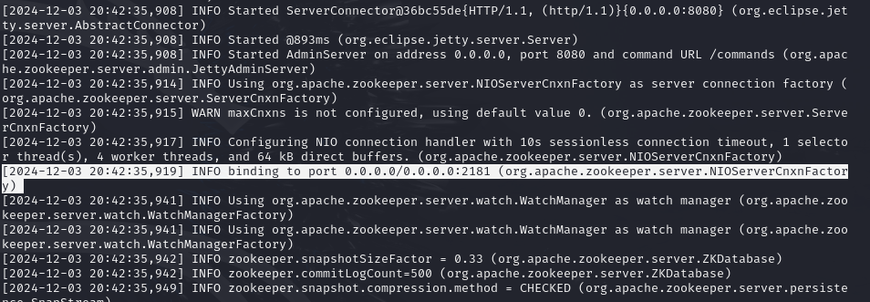

# HA Postres Cluster. Отчет по лабораторной работе

---

## Ход работы

### Поднятие PostgreSQL-кластера

Создадим рабочую директорию `postgres-cluster`.

**Структура файлов:**


---

### Dockerfile

В Dockerfile описан образ для PostgreSQL, дополненный настройками для Patroni:
```Dockerfile
FROM postgres:15

# Устанавливаем зависимости для Patroni
RUN apt-get update -y && \
    apt-get install -y netcat-openbsd python3-pip curl python3-psycopg2 python3-venv iputils-ping

# Устанавливаем Patroni и необходимые библиотеки
RUN python3 -m venv /opt/patroni-venv && \
    /opt/patroni-venv/bin/pip install --upgrade pip && \
    /opt/patroni-venv/bin/pip install patroni[zookeeper] psycopg2-binary

# Копируем конфигурационные файлы Patroni
COPY postgres0.yml /postgres0.yml
COPY postgres1.yml /postgres1.yml

ENV PATH="/opt/patroni-venv/bin:$PATH"

USER postgres
```

---

### docker-compose.yml

Файл описывает три компонента: Node 1 (Master), Node 2 (Slave) и Zookeeper:
```yaml
services:
  pg-master:
    build: .
    image: localhost/postres:patroni # Имя кастомного образа
    container_name: pg-master
    restart: always
    hostname: pg-master
    environment:
      POSTGRES_USER: postgres
      POSTGRES_PASSWORD: postgres
      PGDATA: '/var/lib/postgresql/data/pgdata'
    expose:
      - 8008
    ports:
      - 5433:5432
    volumes:
      - pg-master:/var/lib/postgresql/data
    command: patroni /postgres0.yml

  pg-slave:
    build: .
    image: localhost/postres:patroni
    container_name: pg-slave
    restart: always
    hostname: pg-slave
    expose:
      - 8008
    ports:
      - 5434:5432
    environment:
      POSTGRES_USER: postgres
      POSTGRES_PASSWORD: postgres
      PGDATA: '/var/lib/postgresql/data/pgdata'
    command: patroni /postgres1.yml

  zoo:
    image: confluentinc/cp-zookeeper:7.7.1
    container_name: zoo
    restart: always
    hostname: zoo
    ports:
      - 2181:2181
    environment:
      ZOOKEEPER_CLIENT_PORT: 2181
      ZOOKEEPER_TICK_TIME: 2000

volumes:
  pg-master:
  pg-slave:
```

---

### Конфигурационные файлы Patroni

#### Конфигурация Master (postgres0.yml):
```yaml
scope: my_cluster
name: postgresql0

restapi:
  listen: pg-master:8008
  connect_address: pg-master:8008

zookeeper:
    hosts:
      - zoo:2181

bootstrap:
  dcs:
    ttl: 30
    loop_wait: 10
    retry_timeout: 10
    master_start_timeout: 300
    synchronous_mode: true
    postgresql:
      use_pg_rewind: true
      use_slots: true
      parameters:
        wal_level: replica
        hot_standby: "on"
        max_wal_senders: 10

postgresql:
  listen: 0.0.0.0:5432
  connect_address: pg-master:5432
  data_dir: /var/lib/postgresql/data/postgresql0
  authentication:
    superuser:
      username: postgres
      password: postgres
    replication:
      username: replicator
      password: rep-pass
```

#### Конфигурация Slave (postgres1.yml):
```yaml
scope: my_cluster
name: postgresql1

restapi:
  listen: pg-slave:8008
  connect_address: pg-slave:8008

zookeeper:
    hosts:
      - zoo:2181

bootstrap:
  dcs:
    ttl: 30
    loop_wait: 10
    master_start_timeout: 300
    postgresql:
      use_pg_rewind: true
      use_slots: true

postgresql:
  listen: 0.0.0.0:5432
  connect_address: pg-slave:5432
  data_dir: /var/lib/postgresql/data/postgresql1
  authentication:
    superuser:
      username: postgres
      password: postgres
    replication:
      username: replicator
      password: rep-pass
```

---

### Запуск кластера

После установки всех файлов запускаем Docker Compose:
```bash
docker compose up -d
```

**Примеры вывода:**
- Логи Zookeeper:


- Логи Master:


- Логи Slave:


Ноды работают, связь установлена. Роли Master и Slave могут меняться в процессе.

---

### Проверка репликации

1. Подключаемся к мастер-ноде:
   ```bash
   psql -h localhost -p 5434 -U postgres
   ```
2. Создаём таблицу:
   ```sql
   CREATE TABLE tag (
       id SERIAL PRIMARY KEY,
       data VARCHAR(50),
       value INT);
   ```
3. Добавляем записи через Master:
   
4. Проверяем синхронизацию на Slave:
   

Слейв подтягивает данные только для чтения, недоступен для записи:
```c
ERROR:  cannot execute INSERT in a read-only transaction
```

---

### Настройка HAProxy

Добавляем балансировщик в `docker-compose.yml`:
```yaml
haproxy:
  image: haproxy:3.0
  container_name: postgres_entrypoint
  ports:
    - 5432:5432
    - 7000:7000
  depends_on:
    - pg-master
    - pg-slave
    - zoo
  volumes:
    - ./haproxy.cfg:/usr/local/etc/haproxy/haproxy.cfg
```

Файл конфигурации HAProxy (`haproxy.cfg`):
```toml
global
    maxconn 100

defaults
    mode tcp
    retries 3

listen stats
    mode http
    bind *:7000
    stats enable

listen postgres
    bind *:5432
    option httpchk
    http-check expect status 200
    server pg_master pg-master:5432 check port 8008
    server pg_slave pg-slave:5432 check port 8008
```

**Результат:**
- Балансировщик установлен.


---

### Тестирование отказоустойчивости

**Шаги:**
1. Останавливаем текущего мастера:
   ```bash
   docker stop pg-slave
   ```
2. Анализируем логи:
   - Zookeeper фиксирует падение подключения:
     
   - HAProxy переключается на новую мастер-ноде:
     
   - Бывший Slave становится Master:
     

**Результат:**
База данных остаётся доступной через точку входа HAProxy:  


---

## Вопросы

1) Порты 8008 и 5432 вынесены в разные директивы, expose и ports. По сути, если записать 8008 в ports, то он тоже станет exposed. В чем разница?

* Обе директивы `expose` и `ports` открывают порты, но функционируют по-разному:

1. **Директива `expose`:** 
   - Она открывает порты только во внутренней сети Docker. Эти порты доступны исключительно для использования контейнерами, чтобы обеспечить взаимодействие между ними.
   - Порты, указанные в этой директиве, не доступны извне, то есть они не пробрасываются на хостовую машину.

2. **Директива `ports`:**
   - Эта директива пробрасывает внутренний порт на внешний, и принимает аргументы в формате `внешний:внутренний`. Это позволяет внешним приложениям обращаться к сервисам, выполненным внутри контейнера.
   - Порты, указанные в директиве `ports`, становятся доступны на хосте, что позволяет другим сервисам или пользователям подключаться к контейнерам снаружи.

В качестве подтверждения различий можно привести вывод команды:
```bash
netstat -lntp
```
Эта команда показывает порты на прослушку на хосте. В выводе видно, что открыты все внешние порты, указанные в директиве `ports`. При этом порты, указанные в `expose`, не отображаются в этом выводе. 

Важно отметить, что контейнеры могут взаимодействовать друг с другом через порты, указанные в директиве `expose`, что подтверждается отсутствием ошибок при обращении контейнеров к указанным портам (например, 8008), даже если они не проброшены на хост.

      ```bash
      root@h0tlin3-m1ami:/home/dio/postgres-cluster# netstat -lntp
      Active Internet connections (only servers)
      Proto Recv-Q Send-Q Local Address           Foreign Address         State       PID/Program name    
      tcp        0      0 0.0.0.0:2181            0.0.0.0:*               LISTEN      105223/docker-proxy 
      tcp        0      0 127.0.0.53:53           0.0.0.0:*               LISTEN      345/systemd-resolve 
      tcp        0      0 0.0.0.0:22              0.0.0.0:*               LISTEN      2328/sshd: /usr/sbi 
      tcp        0      0 127.0.0.1:45857         0.0.0.0:*               LISTEN      45869/containerd    
      tcp        0      0 0.0.0.0:5432            0.0.0.0:*               LISTEN      105438/docker-proxy 
      tcp        0      0 0.0.0.0:5433            0.0.0.0:*               LISTEN      105130/docker-proxy 
      tcp        0      0 0.0.0.0:5434            0.0.0.0:*               LISTEN      105167/docker-proxy 
      tcp        0      0 0.0.0.0:7000            0.0.0.0:*               LISTEN      105418/docker-proxy 
      tcp6       0      0 :::2181                 :::*                    LISTEN      105228/docker-proxy 
      tcp6       0      0 :::80                   :::*                    LISTEN      62980/apache2       
      tcp6       0      0 :::22                   :::*                    LISTEN      2328/sshd: /usr/sbi 
      tcp6       0      0 :::5432                 :::*                    LISTEN      105444/docker-proxy 
      tcp6       0      0 :::5433                 :::*                    LISTEN      105137/docker-proxy 
      tcp6       0      0 :::5434                 :::*                    LISTEN      105173/docker-proxy 
      tcp6       0      0 :::7000                 :::*                    LISTEN      105424/docker-proxy
      ```

2) При обычном перезапуске композ-проекта, будет ли сбилден заново образ? А если предварительно отредактировать файлы postgresX.yml? А если содержимое самого Dockerfile? Почему?

* При обычном перезапуске проекта Docker Compose образ не будет пересобран. Docker Compose использует существующие образы, которые уже находятся на хосте. Это означает, что при запуске команд `docker-compose up` или `docker-compose restart` используется уже собранный образ, если исходный Dockerfile или конфигурация не изменялись.

* Редактирование конфигурационных файлов, таких как `postgresX.yml`, не приведет к пересборке образа. Эти файлы монтируются в контейнер как внешние тома, и любые изменения будут применены при следующем запуске контейнера. Таким образом, контейнер будет использовать обновлённые настройки без необходимости пересборки образа.

* Если вы измените содержание Dockerfile, то образ пересоберется только в том случае, если вы запустите команду с флагом `--build`, например:
```bash
docker-compose up --build
```
Важно отметить, что Docker не отслеживает автоматически изменения в Dockerfile. Это значит, что вы должны вручную указать флаг для пересборки образа, если хотите применить изменения.
