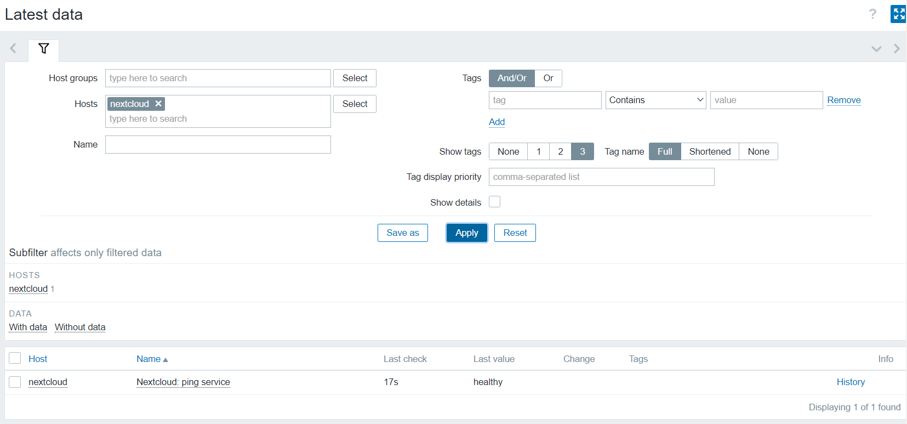
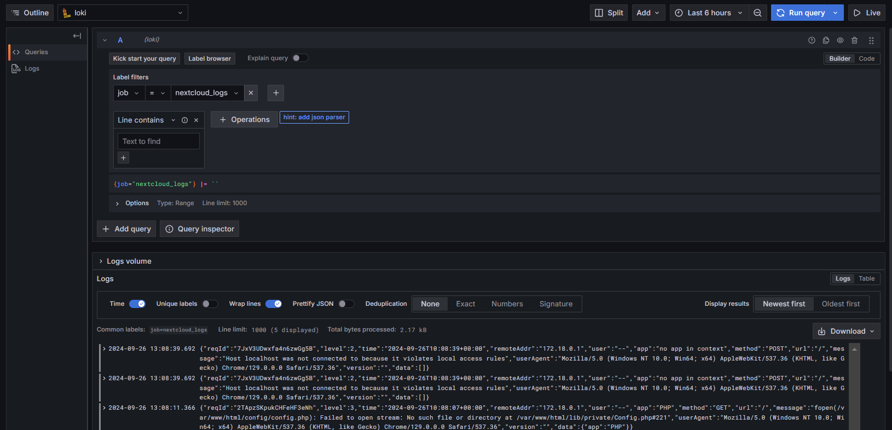
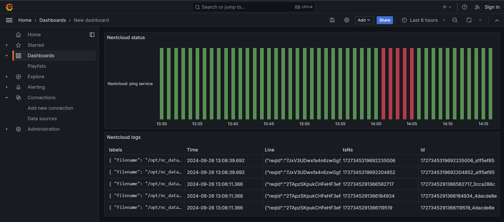

# Loki + Zabbix + Grafana. Отчет по лабораторной работе

## Часть 1. Логирование

Запускаем файл docker-compose.yml

Инициализируем Nextcloud

## Часть 2. Мониторинг

Настраиваем Zabbix и имортируем кастомный шаблон

В разделе Data collection → Hosts создаем хост. Указываем адрес контейнера nextcloud, хост группа - Applications. В поле Templates выбираем добавленный на шаге 2 Templates/Applications→ Test ping template

Переходим в раздел Monitoring → Latest data, где можно увидеть первые данные. В нашем случае значение healthy

Временно включаем в Nextcloud maintenance mode, проверяем что сработал триггер, выключаем режим обратно и убеждаемся, что
проблема помечена как “решенная”

## Часть 3. Визуализация

Подключаем Loki к Grafana, раздел Connections → Data sources → Loki. В настройках подключения указываем имя и адрес http://loki:3100. Сохраняем подключение

Так же подключаем Zabbix: снова добавляем новый датасурс, в качестве URL указываем http://zabbix-frontend:8082/api_jsonrpc.php, заполняем Username и Password, через Save & test проверяем, что подключение успешно

Переходим в Explore, выбираем в качестве селектора job либо filename. Затем нажимпем Run query и видим логи

## Задание 1. Запросы

## Задание 2. Дашборды

## Ответы на вопросы

1. *Чем SLO отличается от SLA?*

**SLO (Service Level Objective):**

- Это конкретные цели, которые устанавливаются для ключевых показателей эффективности работы сервиса, таких как доступность или время отклика.

- SLO описывает уровень сервиса, которого провайдер стремится достичь, например, 99.9% доступности.

- Используется как внутренний инструмент для управления качеством сервиса и мониторинга его эффективности.

**SLA (Service Level Agreement):**

- Это формальный договор между заказчиком и поставщиком услуги, в котором описаны условия предоставления услуги, включая права, обязанности и уровень качества сервиса.

- SLA включает конкретные SLO, которые заказчик и поставщик согласовывают как обязательные для выполнения.

- Если SLA нарушается (например, уровень сервиса ниже оговоренного), это может повлечь за собой штрафные санкции или компенсации для заказчика.

SLO — это техническая цель внутри сервиса, а SLA — это юридически оформленное соглашение о качестве предоставления услуги между сторонами.

2. *Чем отличается инкрементальный бэкап от дифференциального?*

**Инкрементальный бэкап** — это резервное копирование, которое сохраняет только те данные, которые изменились **с момента последнего бэкапа** (не важно, был ли он полным или инкрементальным). То есть, если после полного бэкапа были сделаны несколько инкрементальных, каждый новый инкрементальный бэкап содержит изменения, произошедшие после предыдущего бэкапа.

**Преимущество:** меньшее количество данных для копирования, быстрее выполняется.

**Недостаток:** для восстановления данных нужно восстанавливать последовательно все копии (полный + все инкрементальные).

**Дифференциальный бэкап** — это резервное копирование, которое сохраняет все изменения, произошедшие **с момента последнего полного бэкапа**. Таким образом, каждый последующий дифференциальный бэкап включает в себя изменения, накопленные с момента полного бэкапа, независимо от того, сколько времени прошло и сколько бэкапов было сделано до этого.

**Преимущество:** процесс восстановления проще и быстрее, чем в случае инкрементального.

**Недостаток:** размер дифференциальной копии увеличивается с каждым днем после полного бэкапа, так как сохраняются все изменения с момента последнего полного резервного копирования.

**Основное различие:**

- Инкрементальный: копирует изменения после последнего любого бэкапа.

- Дифференциальный: копирует изменения только после последнего полного бэкапа.

3. *В чем разница между мониторингом и observability?*

**Мониторинг:**

Мониторинг — это процесс сбора, анализа и отображения данных о работе системы с использованием заранее определенных метрик и предупреждений. В рамках мониторинга администраторы и инженеры наблюдают за тем, что **уже известно** о системе. Обычно мониторинг настроен для отслеживания конкретных показателей, таких как:

- Загруженность CPU

- Использование памяти

- Время отклика приложения

- Доступность сервисов

Мониторинг направлен на **реактивное** поведение: отслеживание заранее известных проблем или сбоев в системе, чтобы своевременно реагировать на инциденты.

**Observability:**

Observability — это более широкий и **проактивный** подход, который позволяет глубже понять состояние системы, исходя из ее внутренних сигналов. Это концепция, которая помогает отвечать на вопрос: **почему** система ведёт себя определённым образом. **Observability** включает три ключевых компонента:

- Логи — записи о событиях в системе.

- Метрики — числовые данные, которые можно агрегировать и анализировать.

- Трейсы — детализированные следы выполнения операций, которые помогают понять, как отдельные запросы проходят через систему.

**Observability** позволяет инженерам исследовать поведение системы, даже когда проблема еще не определена. Она делает акцент на возможности **задавать новые вопросы**, когда происходят неизвестные сбои или аномалии.

**Основное различие:**

- **Мониторинг** фокусируется на **заранее определенных метриках** и предупреждениях для отслеживания известных проблем.

- **Observability** предоставляет **глубокое понимание** системы для поиска причин неизвестных сбоев, помогая диагностировать новые, неочевидные проблемы.
